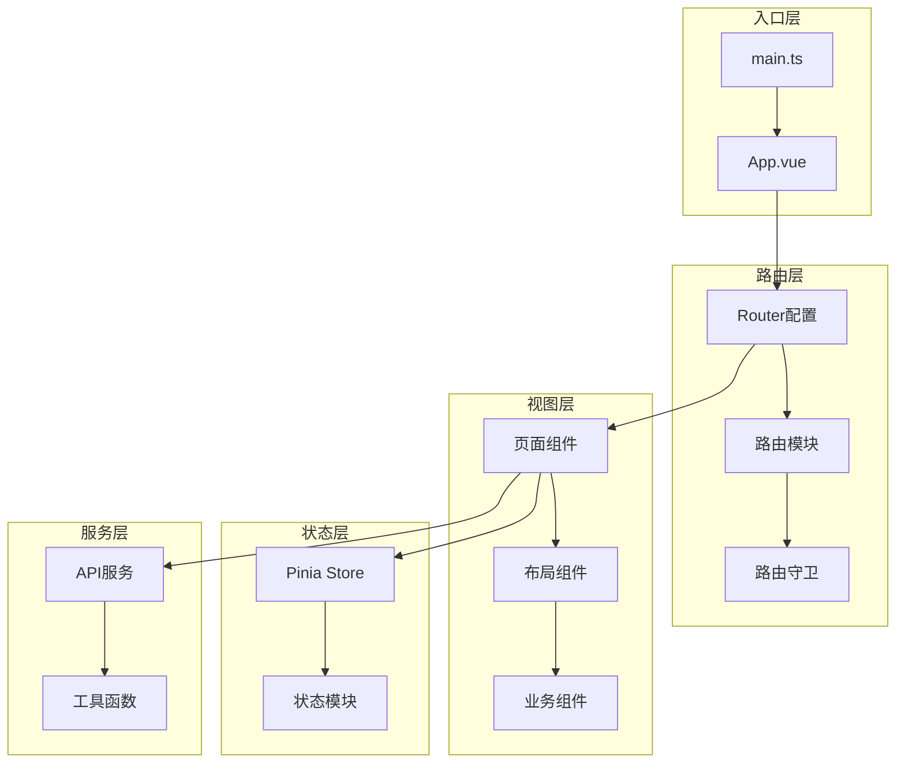
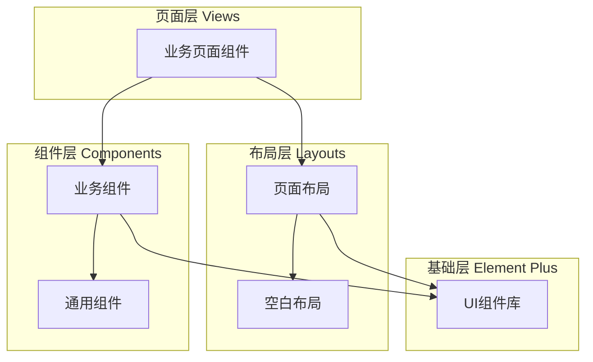

# 前端架构详解

## 🏗️ 整体架构设计

前端采用 **Vue 3 + TypeScript + Element Plus** 的现代化架构，基于 **组件化、模块化、类型安全** 的设计理念。



## 📁 目录结构解析

```
src/
├── 📄 main.ts                    # 应用入口点
├── 📄 App.vue                    # 根组件
├── 📁 assets/                    # 静态资源
│   ├── 📁 icons/                 # 图标资源
│   ├── 📁 login/                 # 登录相关资源
│   └── 📄 logo.png               # 应用Logo
├── 📁 components/                # 公共组件库
│   ├── 📄 TsxComponents.tsx      # TSX组件示例
│   ├── 📁 Application/           # 应用级组件
│   └── 📁 SvgIcon/               # SVG图标组件
├── 📁 views/                     # 页面视图
│   ├── 📁 launcher/              # 启动器页面
│   ├── 📁 login/                 # 登录页面
│   ├── 📁 nested/                # 嵌套路由示例
│   ├── 📁 permissions/           # 权限管理页面
│   └── 📄 api-test.vue           # API测试页面
├── 📁 layouts/                   # 布局组件
│   ├── 📁 empty-layouts/         # 空白布局
│   ├── 📁 page-layouts/          # 页面布局
│   └── 📁 redirect/              # 重定向组件
├── 📁 router/                    # 路由配置
│   ├── 📄 index.ts               # 路由主配置
│   ├── 📄 utils.ts               # 路由工具函数
│   ├── 📄 type.ts                # 路由类型定义
│   └── 📁 modules/               # 路由模块
├── 📁 store/                     # 状态管理
│   ├── 📄 index.ts               # Store主入口
│   ├── 📄 types.ts               # Store类型定义
│   └── 📁 modules/               # Store模块
├── 📁 hooks/                     # 组合式API
│   ├── 📄 useCurrentInstance.ts  # 实例获取Hook
│   ├── 📁 event/                 # 事件相关Hook
│   ├── 📁 setting/               # 设置相关Hook
│   └── 📁 web/                   # Web API Hook
├── 📁 utils/                     # 工具函数库
│   ├── 📄 index.ts               # 工具函数入口
│   ├── 📄 mitt.ts                # 事件总线
│   ├── 📄 waterMark.ts           # 水印工具
│   ├── 📁 axios/                 # HTTP请求封装
│   ├── 📁 operate/               # 操作相关工具
│   ├── 📁 plugin/                # 插件工具
│   └── 📁 theme/                 # 主题工具
├── 📁 styles/                    # 样式文件
│   ├── 📄 index.scss             # 全局样式入口
│   ├── 📄 tailwind.css           # TailwindCSS配置
│   ├── 📄 theme.scss             # 主题样式
│   ├── 📄 sidebar.scss           # 侧边栏样式
│   └── 📁 var/                   # CSS变量
├── 📁 types/                     # TypeScript类型定义
│   ├── 📄 launcher.ts            # 启动器类型
│   ├── 📄 global.d.ts            # 全局类型声明
│   └── 📄 env.d.ts               # 环境变量类型
├── 📁 locales/                   # 国际化
│   ├── 📄 index.ts               # i18n配置
│   ├── 📄 types.ts               # 语言类型
│   └── 📁 modules/               # 语言包模块
├── 📁 mock/                      # Mock数据
│   └── 📄 launcher.mock.ts       # 启动器Mock API
├── 📁 server/                    # 服务配置
│   ├── 📄 config.ts              # 服务器配置
│   ├── 📄 route.ts               # 路由配置
│   └── 📄 useInfo.ts             # 用户信息服务
└── 📁 enum/                      # 枚举定义
    ├── 📄 locales.ts             # 语言枚举
    └── 📄 role.ts                # 角色枚举
```

## 🛣️ 路由架构设计

### 路由系统核心特性

#### 1. 🔄 动态路由模块加载

```typescript
// src/router/modules/index.ts
const modules = import.meta.glob('./**/*.ts', { eager: true });

// 自动扫描并分类路由
const whiteRouteModulesList: RouteConfigsTable[] = [];  // 白名单路由
const routeModulesList: RouteConfigsTable[] = [];       // 需权限路由

Object.keys(modules).forEach((key) => {
  const mod = modules[key]?.default || {};
  
  // 根据路径分类路由
  if (key.includes('/modules/error/') || 
      key.includes('/modules/login/') || 
      key.includes('/modules/redirect/')) {
    whiteRouteModulesList.push(mod);
  } else {
    routeModulesList.push(mod);
  }
});
```

#### 2. 📋 路由配置标准

```typescript
// 路由模块标准格式
export default {
  path: '/launcher',              // 路由路径
  name: 'RtLauncher',            // 唯一路由名称  
  component: () => import('@/views/launcher/index.vue'),
  meta: {
    title: '程序启动器',          // 页面标题
    icon: 'iEL-management',       // 菜单图标
    showLink: true,              // 是否在侧边栏显示
    rank: 3,                     // 菜单排序权重
  },
} satisfies RouteConfigsTable;
```

#### 3. 🔐 路由守卫系统

```typescript
// 全局前置守卫
router.beforeEach(async (to, from, next) => {
  // 1. 权限验证
  if (to.meta.requiresAuth && !store.user.isLoggedIn) {
    return next('/login');
  }
  
  // 2. 页面标题设置
  document.title = to.meta.title || 'Wrapper Assistant';
  
  // 3. 权限路由过滤
  await store.permission.buildRoutes();
  
  next();
});
```

### 路由模块组织

```
router/modules/
├── 📄 api-test.ts              # API测试路由
├── 📄 error/                   # 错误页面路由
│   ├── 403.ts
│   ├── 404.ts  
│   └── 500.ts
├── 📄 launcher/                # 启动器路由
│   └── index.ts
├── 📄 login/                   # 登录路由
│   └── index.ts
├── 📄 nested/                  # 嵌套路由示例
│   └── index.ts
└── 📄 permissions/             # 权限管理路由
    └── index.ts
```

## 🧩 组件架构设计

### 组件分层架构



### 组件命名规范

```typescript
// 页面组件 (PascalCase + 后缀)
LauncherIndex.vue          // 启动器首页
LoginForm.vue              // 登录表单

// 业务组件 (PascalCase)
ProgramCard.vue            // 程序卡片
SearchBar.vue              // 搜索栏

// 通用组件 (前缀 + PascalCase)
SvgIcon.vue                // SVG图标
AppHeader.vue              // 应用头部
```

### 组件通信模式

```typescript
// 1. Props + Emit (父子通信)
defineProps<{
  programs: LaunchItem[];
  loading?: boolean;
}>();

const emit = defineEmits<{
  select: [program: LaunchItem];
  refresh: [];
}>();

// 2. Provide/Inject (跨层通信)
// 父组件
provide('theme', theme);

// 子孙组件
const theme = inject<Theme>('theme');

// 3. Pinia Store (全局状态)
const store = useLauncherStore();

// 4. Event Bus (组件解耦)
import { emitter } from '@/utils/mitt';
emitter.emit('refresh-list');
```

## 📊 状态管理架构

### Pinia Store模块化

```
store/modules/
├── 📄 app.ts                   # 应用全局状态
├── 📄 permission.ts            # 权限路由状态
├── 📄 user.ts                  # 用户信息状态
└── 📄 launcher.ts              # 启动器状态 (自定义)
```

### Store设计模式

```typescript
// src/store/modules/launcher.ts
export const useLauncherStore = defineStore('launcher', () => {
  // State
  const programs = ref<LaunchItem[]>([]);
  const loading = ref(false);
  const searchKeyword = ref('');
  
  // Getters
  const filteredPrograms = computed(() => 
    programs.value.filter(p => 
      p.name.includes(searchKeyword.value)
    )
  );
  
  // Actions
  async function fetchPrograms() {
    loading.value = true;
    try {
      const result = await invoke('get_all_launch_items');
      programs.value = result;
    } catch (error) {
      console.error('获取程序列表失败:', error);
    } finally {
      loading.value = false;
    }
  }
  
  async function launchProgram(program: LaunchItem) {
    await invoke('launch_program', { req: program });
  }
  
  return {
    // State
    programs,
    loading,
    searchKeyword,
    
    // Getters  
    filteredPrograms,
    
    // Actions
    fetchPrograms,
    launchProgram,
  };
});
```

## 🎨 样式架构设计

### CSS架构分层

```scss
// styles/index.scss - 样式入口
@import './var/index.scss';        // CSS变量
@import './mixin.scss';            // Mixins
@import './theme.scss';            // 主题样式
@import './sidebar.scss';          // 侧边栏样式
@import './transition.scss';       // 过渡动画
@import './nprogress.scss';        // 进度条样式
@import './tailwind.css';          // TailwindCSS
```

### 主题系统

```scss
// styles/var/index.scss
:root {
  // 主色调
  --el-color-primary: #409eff;
  --el-color-primary-light-3: #79bbff;
  --el-color-primary-dark-2: #337ecc;
  
  // 背景色
  --el-bg-color: #ffffff;
  --el-bg-color-page: #f2f3f5;
  
  // 文字色
  --el-text-color-primary: #303133;
  --el-text-color-regular: #606266;
}

// 暗色主题
[data-theme='dark'] {
  --el-bg-color: #1d1e1f;
  --el-bg-color-page: #0a0a0a;
  --el-text-color-primary: #e5eaf3;
}
```

### TailwindCSS集成

```typescript
// tailwind.config.js
export default {
  content: ['./src/**/*.{vue,js,ts,jsx,tsx}'],
  theme: {
    extend: {
      colors: {
        primary: 'var(--el-color-primary)',
        success: 'var(--el-color-success)',
        warning: 'var(--el-color-warning)',
        danger: 'var(--el-color-danger)',
      },
    },
  },
  plugins: [],
};
```

## 🔧 工具函数架构

### 工具模块组织

```
utils/
├── 📄 index.ts                 # 工具函数入口
├── 📄 mitt.ts                  # 事件总线
├── 📄 waterMark.ts             # 水印工具
├── 📁 axios/                   # HTTP封装
│   ├── index.ts
│   ├── config.ts
│   └── interceptors.ts
├── 📁 operate/                 # 操作工具
│   ├── download.ts
│   └── clipboard.ts
├── 📁 plugin/                  # 插件工具
│   ├── directive.ts
│   └── component.ts
└── 📁 theme/                   # 主题工具
    ├── index.ts
    └── toggle.ts
```

### TypeScript类型系统

```typescript
// types/global.d.ts - 全局类型声明
declare global {
  interface Window {
    __TAURI__: any;
  }
  
  // 环境变量类型
  interface ImportMetaEnv {
    readonly VITE_USE_MOCK_DATA: string;
    readonly VITE_API_BASE_URL: string;
  }
}

// types/launcher.ts - 业务类型
export interface LaunchItem {
  name: string;
  target_path: string;
  arguments?: string;
  count: number;
  icon_base64?: string;
  category?: string;
}

export interface LauncherStore {
  programs: LaunchItem[];
  loading: boolean;
  searchKeyword: string;
}
```

## 🎯 架构优势总结

### 开发体验优势
- ✅ **类型安全**: TypeScript全链路类型检查
- ✅ **热更新**: Vite快速开发服务器
- ✅ **模块化**: 清晰的模块边界和职责分离
- ✅ **组合式API**: Vue 3 Composition API提高代码复用性

### 维护性优势
- ✅ **路由自动化**: 动态路由扫描，减少手动配置
- ✅ **状态集中**: Pinia统一状态管理
- ✅ **样式系统**: 主题变量 + TailwindCSS原子化
- ✅ **工具标准化**: 统一的工具函数和类型定义

### 扩展性优势
- ✅ **插件化**: 易于添加新功能模块
- ✅ **国际化**: 内置i18n支持
- ✅ **主题切换**: 支持亮色/暗色主题
- ✅ **权限系统**: 灵活的路由权限控制

这个前端架构为项目提供了 **现代化、可维护、可扩展** 的开发基础，确保了代码质量和开发效率。
