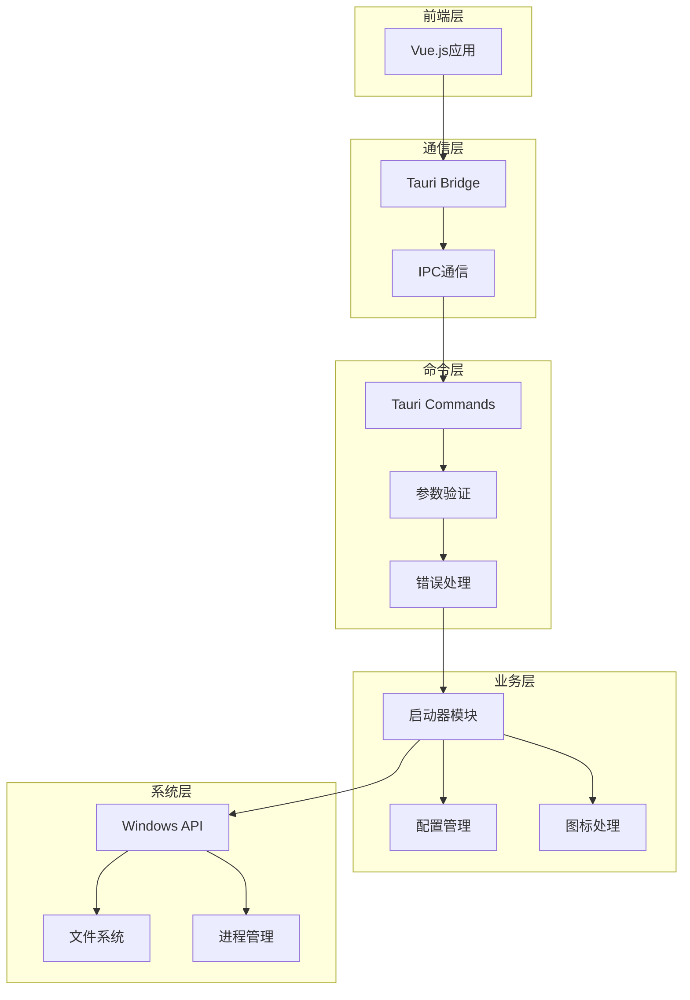

# 后端架构详解

## 🏗️ Tauri + Rust 后端架构

后端采用 **Tauri 2.2.0 + Rust** 的现代化系统级架构，提供高性能、内存安全的原生桌面应用后端服务。



## 📁 后端项目结构

```
src-tauri/
├── 📄 Cargo.toml               # Rust项目配置
├── 📄 Cargo.lock               # 依赖锁定文件
├── 📄 build.rs                 # 构建脚本
├── 📄 tauri.conf.json          # Tauri配置文件
├── 📁 src/                     # Rust源代码
│   ├── 📄 main.rs              # 程序入口点
│   ├── 📄 lib.rs               # 库配置和命令注册
│   ├── 📄 commands.rs          # Tauri命令集合
│   ├── 📄 launcher.rs          # 启动器核心逻辑
│   ├── 📄 config.rs            # 配置文件管理
│   └── 📄 tests.rs             # 单元测试
├── 📁 icons/                   # 应用图标
│   ├── 📄 logo.ico
│   └── 📄 logo-128x128.png
├── 📁 capabilities/            # Tauri权限配置
│   ├── 📄 desktop.json
│   └── 📄 migrated.json
├── 📁 gen/                     # 自动生成文件
│   └── 📁 schemas/
└── 📁 target/                  # 构建输出目录
    ├── 📁 debug/
    └── 📁 release/
```

## ⚙️ Tauri配置架构

### 核心配置文件解析

```json5
// tauri.conf.json
{
  "productName": "Wrapper Assistant",      // 产品名称
  "version": "0.1.0",                      // 版本号
  "identifier": "com.example.wrapper",     // 应用标识符
  
  "app": {
    "windows": [
      {
        "title": "Wrapper Assistant",       // 窗口标题
        "width": 1200,                      // 默认宽度
        "height": 800,                      // 默认高度
        "minWidth": 800,                    // 最小宽度
        "minHeight": 600,                   // 最小高度
        "resizable": true,                  // 可调整大小
        "fullscreen": false                 // 非全屏模式
      }
    ],
    "security": {
      "csp": "default-src 'self' tauri:",   // 内容安全策略
      "devCsp": "default-src 'self' tauri: http://localhost:5173"
    }
  },
  
  "bundle": {
    "active": true,
    "targets": ["nsis", "msi"],             // Windows打包格式
    "publisher": "Example Corp",            // 发布者
    "copyright": "© 2025 Example Corp",     // 版权信息
    "category": "Productivity",             // 应用分类
    "shortDescription": "程序启动器管理工具",
    "longDescription": "一个现代化的程序启动器管理桌面应用",
    
    "windows": {
      "certificateThumbprint": null,        // 代码签名证书
      "digestAlgorithm": "sha256",          // 摘要算法
      "timestampUrl": ""                    // 时间戳服务器
    }
  }
}
```

### 权限系统配置

```json5
// capabilities/desktop.json  
{
  "identifier": "desktop",
  "description": "桌面应用权限配置",
  "windows": ["main"],
  "permissions": [
    "core:default",                         // 核心权限
    "shell:allow-execute",                  // 允许执行外部程序
    "fs:allow-read-text-file",             // 允许读取文本文件
    "fs:allow-write-text-file",            // 允许写入文本文件
    "fs:allow-create",                     // 允许创建文件
    "path:default",                        // 路径操作权限
    "dialog:allow-open",                   // 允许打开对话框
    "dialog:allow-save"                    // 允许保存对话框
  ]
}
```

## 🦀 Rust代码架构

### 项目入口配置

```rust
// src/main.rs - 应用程序入口
#![cfg_attr(not(debug_assertions), windows_subsystem = "windows")]

use tauri::Manager;
use window_shadows::set_shadow;

fn main() {
    tauri::Builder::default()
        .plugin(tauri_plugin_shell::init())      // Shell插件
        .plugin(tauri_plugin_fs::init())         // 文件系统插件
        .plugin(tauri_plugin_dialog::init())     // 对话框插件
        .invoke_handler(tauri::generate_handler![
            commands::get_all_launch_items,      // 获取启动项
            commands::launch_program,            // 启动程序
            commands::get_icon_base64,           // 获取图标
            commands::scan_system_programs,      // 扫描系统程序
            commands::add_launch_item,           // 添加启动项
            commands::edit_launch_item,          // 编辑启动项
            commands::remove_launch_item,        // 删除启动项
            commands::get_launch_config,         // 获取配置
            commands::save_launch_config,        // 保存配置
        ])
        .setup(|app| {
            let window = app.get_webview_window("main").unwrap();
            
            // 设置窗口阴影 (Windows/macOS)
            #[cfg(any(windows, target_os = "macos"))]
            set_shadow(&window, true).expect("不支持窗口阴影");
            
            Ok(())
        })
        .run(tauri::generate_context!())
        .expect("运行Tauri应用时出错");
}
```

### 命令系统架构

```rust
// src/commands.rs - 命令集合
use tauri::command;
use crate::launcher::{LaunchItem, LaunchConfig, LaunchRequest};
use crate::config::{load_config, save_config};

/// 获取所有启动项配置
#[command]
pub async fn get_all_launch_items() -> Result<LaunchConfig, String> {
    match load_config().await {
        Ok(config) => Ok(config),
        Err(e) => {
            eprintln!("加载配置失败: {}", e);
            // 返回默认配置
            Ok(LaunchConfig::default())
        }
    }
}

/// 启动指定程序
#[command]
pub async fn launch_program(req: LaunchRequest) -> Result<String, String> {
    crate::launcher::launch_program_impl(&req).await
}

/// 获取程序图标 (Base64编码)
#[command]
pub async fn get_icon_base64(path: String) -> Result<String, String> {
    crate::launcher::extract_icon_to_base64(&path).await
}

/// 扫描系统中的程序
#[command]
pub async fn scan_system_programs() -> Result<Vec<LaunchItem>, String> {
    crate::launcher::scan_system_programs_impl().await
}

/// 添加新的启动项
#[command]
pub async fn add_launch_item(item: LaunchItem) -> Result<String, String> {
    let mut config = load_config().await.unwrap_or_default();
    config.items.push(item);
    
    save_config(&config).await
        .map_err(|e| format!("保存配置失败: {}", e))?;
    
    Ok("启动项添加成功".to_string())
}

/// 编辑现有启动项
#[command]
pub async fn edit_launch_item(index: usize, item: LaunchItem) -> Result<String, String> {
    let mut config = load_config().await.unwrap_or_default();
    
    if index >= config.items.len() {
        return Err("无效的启动项索引".to_string());
    }
    
    config.items[index] = item;
    
    save_config(&config).await
        .map_err(|e| format!("保存配置失败: {}", e))?;
    
    Ok("启动项更新成功".to_string())
}

/// 删除启动项
#[command]
pub async fn remove_launch_item(index: usize) -> Result<String, String> {
    let mut config = load_config().await.unwrap_or_default();
    
    if index >= config.items.len() {
        return Err("无效的启动项索引".to_string());
    }
    
    config.items.remove(index);
    
    save_config(&config).await
        .map_err(|e| format!("保存配置失败: {}", e))?;
    
    Ok("启动项删除成功".to_string())
}
```

## 🚀 启动器核心模块

### 数据结构设计

```rust
// src/launcher.rs - 核心数据结构
use serde::{Deserialize, Serialize};

/// 启动项配置
#[derive(Debug, Clone, Serialize, Deserialize)]
pub struct LaunchItem {
    pub name: String,              // 程序名称
    pub target_path: String,       // 程序路径
    pub arguments: String,         // 启动参数
    pub count: u32,               // 使用次数统计
    pub icon_base64: Option<String>, // Base64编码图标
}

/// 启动配置文件
#[derive(Debug, Serialize, Deserialize)]
pub struct LaunchConfig {
    pub items: Vec<LaunchItem>,    // 启动项列表
    pub version: String,           // 配置版本
    pub last_updated: String,      // 最后更新时间
}

impl Default for LaunchConfig {
    fn default() -> Self {
        Self {
            items: Vec::new(),
            version: "1.0.0".to_string(),
            last_updated: chrono::Utc::now().to_rfc3339(),
        }
    }
}

/// 启动请求参数
#[derive(Debug, Deserialize)]
pub struct LaunchRequest {
    pub name: String,
    pub target_path: String,
    pub arguments: Option<String>,
    pub as_admin: Option<bool>,    // 是否以管理员身份运行
}
```

### Windows系统集成

```rust
// src/launcher.rs - Windows API集成
use std::ffi::OsStr;
use std::os::windows::ffi::OsStrExt;
use winapi::um::shellapi::ShellExecuteW;
use winapi::um::winuser::SW_SHOWNORMAL;

/// 启动程序实现
pub async fn launch_program_impl(req: &LaunchRequest) -> Result<String, String> {
    let target_path = resolve_path_variables(&req.target_path);
    let arguments = req.arguments.as_deref().unwrap_or("");
    let as_admin = req.as_admin.unwrap_or(false);
    
    // 验证程序路径存在
    if !std::path::Path::new(&target_path).exists() {
        return Err(format!("程序路径不存在: {}", target_path));
    }
    
    unsafe {
        // 转换为Windows宽字符串
        let operation = if as_admin { "runas" } else { "open" };
        let operation_wide = to_wide_string(operation);
        let target_wide = to_wide_string(&target_path);
        let args_wide = to_wide_string(arguments);
        
        // 调用Windows API启动程序
        let result = ShellExecuteW(
            std::ptr::null_mut(),           // 父窗口句柄
            operation_wide.as_ptr(),        // 操作类型
            target_wide.as_ptr(),           // 程序路径
            args_wide.as_ptr(),             // 启动参数
            std::ptr::null(),               // 工作目录
            SW_SHOWNORMAL,                  // 显示方式
        );
        
        if result as isize <= 32 {
            return Err(format!("启动程序失败，错误代码: {}", result as isize));
        }
    }
    
    // 更新使用计数
    update_launch_count(&req.name).await?;
    
    Ok(format!("程序 '{}' 启动成功", req.name))
}

/// 路径变量解析
fn resolve_path_variables(path: &str) -> String {
    path.replace("%%rp%%", &get_current_exe_dir())
        .replace("%%rr%%", &get_project_root_dir())
}

/// 转换为Windows宽字符串
fn to_wide_string(s: &str) -> Vec<u16> {
    OsStr::new(s)
        .encode_wide()
        .chain(std::iter::once(0))
        .collect()
}
```

### 图标提取系统

```rust
// src/launcher.rs - 图标提取
use winapi::um::shellapi::ExtractIconW;
use winapi::um::wingdi::GetDIBits;

/// 提取程序图标并转换为Base64
pub async fn extract_icon_to_base64(path: &str) -> Result<String, String> {
    let path_resolved = resolve_path_variables(path);
    
    if !std::path::Path::new(&path_resolved).exists() {
        return Err("程序文件不存在".to_string());
    }
    
    unsafe {
        let path_wide = to_wide_string(&path_resolved);
        
        // 提取图标
        let icon_handle = ExtractIconW(
            std::ptr::null_mut(),
            path_wide.as_ptr(),
            0,  // 提取第一个图标
        );
        
        if icon_handle.is_null() {
            return Err("无法提取程序图标".to_string());
        }
        
        // 将图标转换为位图数据
        let bitmap_data = icon_to_bitmap_data(icon_handle)?;
        
        // 编码为Base64
        let base64_string = base64::encode(bitmap_data);
        Ok(format!("data:image/png;base64,{}", base64_string))
    }
}

/// 扫描系统程序
pub async fn scan_system_programs_impl() -> Result<Vec<LaunchItem>, String> {
    let mut programs = Vec::new();
    
    // 扫描常见程序安装目录
    let search_paths = vec![
        "C:\\Program Files",
        "C:\\Program Files (x86)",
        "C:\\Windows\\System32",
    ];
    
    for path in search_paths {
        if let Ok(entries) = std::fs::read_dir(path) {
            for entry in entries.flatten() {
                if let Some(program) = try_create_launch_item(&entry.path()).await {
                    programs.push(program);
                }
            }
        }
    }
    
    // 按名称排序
    programs.sort_by(|a, b| a.name.cmp(&b.name));
    
    Ok(programs)
}
```

## 💾 配置管理系统

```rust
// src/config.rs - 配置文件管理
use std::path::PathBuf;
use tokio::fs;
use tokio::io::{AsyncReadExt, AsyncWriteExt};
use crate::launcher::LaunchConfig;

/// 获取配置文件路径
pub fn get_config_path() -> PathBuf {
    let mut config_dir = dirs::config_dir()
        .unwrap_or_else(|| PathBuf::from("."));
    config_dir.push("wrapper_assistant");
    
    // 确保配置目录存在
    if !config_dir.exists() {
        std::fs::create_dir_all(&config_dir)
            .expect("无法创建配置目录");
    }
    
    config_dir.push("launch_config.json");
    config_dir
}

/// 加载配置文件
pub async fn load_config() -> Result<LaunchConfig, Box<dyn std::error::Error>> {
    let config_path = get_config_path();
    
    if !config_path.exists() {
        // 配置文件不存在，创建默认配置
        let default_config = LaunchConfig::default();
        save_config(&default_config).await?;
        return Ok(default_config);
    }
    
    let mut file = fs::File::open(config_path).await?;
    let mut contents = String::new();
    file.read_to_string(&mut contents).await?;
    
    let config: LaunchConfig = serde_json::from_str(&contents)?;
    Ok(config)
}

/// 保存配置文件
pub async fn save_config(config: &LaunchConfig) -> Result<(), Box<dyn std::error::Error>> {
    let config_path = get_config_path();
    let json_data = serde_json::to_string_pretty(config)?;
    
    let mut file = fs::File::create(config_path).await?;
    file.write_all(json_data.as_bytes()).await?;
    file.flush().await?;
    
    Ok(())
}

/// 备份配置文件
pub async fn backup_config() -> Result<PathBuf, Box<dyn std::error::Error>> {
    let config_path = get_config_path();
    let mut backup_path = config_path.clone();
    backup_path.set_extension("json.bak");
    
    fs::copy(&config_path, &backup_path).await?;
    Ok(backup_path)
}
```

## 🧪 测试系统

```rust
// src/tests.rs - 单元测试
#[cfg(test)]
mod tests {
    use super::*;
    use tokio;
    
    #[tokio::test]
    async fn test_config_operations() {
        // 测试配置加载和保存
        let config = LaunchConfig::default();
        assert!(save_config(&config).await.is_ok());
        
        let loaded_config = load_config().await.unwrap();
        assert_eq!(loaded_config.version, config.version);
    }
    
    #[tokio::test] 
    async fn test_launch_item_creation() {
        let item = LaunchItem {
            name: "测试程序".to_string(),
            target_path: "C:\\Windows\\System32\\notepad.exe".to_string(),
            arguments: "".to_string(),
            count: 0,
            icon_base64: None,
        };
        
        assert_eq!(item.name, "测试程序");
        assert!(!item.target_path.is_empty());
    }
    
    #[tokio::test]
    async fn test_path_variable_resolution() {
        let test_path = "%%rp%%\\test.exe";
        let resolved = resolve_path_variables(test_path);
        assert!(!resolved.contains("%%rp%%"));
    }
    
    #[test]
    fn test_wide_string_conversion() {
        let test_str = "hello world";
        let wide_string = to_wide_string(test_str);
        assert!(!wide_string.is_empty());
        assert_eq!(wide_string.last(), Some(&0)); // 确保以null结尾
    }
    
    #[tokio::test]
    async fn test_icon_extraction() {
        let notepad_path = "C:\\Windows\\System32\\notepad.exe";
        if std::path::Path::new(notepad_path).exists() {
            let result = extract_icon_to_base64(notepad_path).await;
            assert!(result.is_ok());
            
            let base64_data = result.unwrap();
            assert!(base64_data.starts_with("data:image/"));
        }
    }
}
```

## 🔧 依赖管理

### Cargo.toml配置

```toml
[package]
name = "wrapper-assistant"
version = "0.1.0"
edition = "2021"
rust-version = "1.77.2"

[build-dependencies]
tauri-build = { version = "2.0", features = [] }

[dependencies]
# Tauri核心
tauri = { version = "2.2", features = ["macos-private-api"] }
tauri-plugin-shell = "2.0"
tauri-plugin-fs = "2.0" 
tauri-plugin-dialog = "2.0"

# 序列化
serde = { version = "1.0", features = ["derive"] }
serde_json = "1.0"

# 异步运行时
tokio = { version = "1.0", features = ["full"] }

# 时间处理
chrono = { version = "0.4", features = ["serde"] }

# 编码
base64 = "0.22"

# 系统目录
dirs = "5.0"

# 窗口阴影
window-shadows = "0.2"

# Windows特定依赖
[target.'cfg(windows)'.dependencies]
winapi = { version = "0.3", features = [
    "winuser", "shellapi", "wingdi", "windef", "minwindef", "handleapi"
]}
windows = { version = "0.58", features = [
    "Win32_UI_Shell", "Win32_UI_WindowsAndMessaging", 
    "Win32_Graphics_Gdi", "Win32_System_LibraryLoader"
]}
```

## 📊 性能优化策略

### 1. 异步操作优化

```rust
// 使用异步I/O避免阻塞
pub async fn load_config_async() -> Result<LaunchConfig, Error> {
    tokio::task::spawn_blocking(|| {
        // 在单独线程中执行I/O密集操作
        load_config_sync()
    }).await?
}

// 并发处理多个任务
pub async fn scan_multiple_directories(paths: Vec<&str>) -> Vec<LaunchItem> {
    let tasks: Vec<_> = paths.into_iter()
        .map(|path| tokio::spawn(scan_directory(path.to_string())))
        .collect();
    
    let mut results = Vec::new();
    for task in tasks {
        if let Ok(items) = task.await {
            results.extend(items);
        }
    }
    results
}
```

### 2. 内存管理优化

```rust
// 使用引用避免不必要的克隆
pub fn process_launch_items(items: &[LaunchItem]) -> Vec<String> {
    items.iter()
        .map(|item| format_launch_item(item))
        .collect()
}

// 使用Cow减少内存分配
use std::borrow::Cow;

pub fn resolve_path<'a>(path: &'a str) -> Cow<'a, str> {
    if path.contains("%%") {
        Cow::Owned(resolve_path_variables(path))
    } else {
        Cow::Borrowed(path)
    }
}
```

## 🔒 安全特性

### 1. 输入验证

```rust
// 路径安全验证
pub fn validate_file_path(path: &str) -> Result<(), String> {
    // 防止路径遍历攻击
    if path.contains("..") {
        return Err("不允许使用相对路径".to_string());
    }
    
    // 检查危险字符
    let dangerous_chars = ['<', '>', '|', '?', '*'];
    if path.chars().any(|c| dangerous_chars.contains(&c)) {
        return Err("路径包含非法字符".to_string());
    }
    
    Ok(())
}

// 参数过滤
pub fn sanitize_arguments(args: &str) -> String {
    // 移除潜在的危险参数
    args.replace("&", "")
        .replace("|", "")
        .replace(";", "")
}
```

### 2. 权限控制

```rust
// 检查文件权限
pub fn check_file_permissions(path: &std::path::Path) -> bool {
    use std::os::windows::fs::MetadataExt;
    
    if let Ok(metadata) = path.metadata() {
        // 检查文件是否可执行
        return !metadata.file_attributes() & 0x1 != 0; // FILE_ATTRIBUTE_READONLY
    }
    false
}
```

## 🎯 架构优势总结

### 性能优势
- ✅ **零成本抽象**: Rust编译时优化，运行时无额外开销
- ✅ **内存安全**: 编译时内存管理，无垃圾回收器
- ✅ **并发安全**: Rust所有权系统防止数据竞争
- ✅ **系统调用**: 直接调用Windows API，无中间层

### 安全优势
- ✅ **类型安全**: 强类型系统防止运行时错误
- ✅ **内存保护**: 防止缓冲区溢出和悬空指针
- ✅ **权限最小化**: Tauri安全模型限制API调用
- ✅ **输入验证**: 多层参数验证和过滤

### 维护优势
- ✅ **模块化设计**: 清晰的功能边界和职责分离
- ✅ **错误处理**: Result类型统一错误处理流程
- ✅ **测试覆盖**: 全面的单元测试和集成测试
- ✅ **文档齐全**: 详细的代码注释和架构文档

这个后端架构为应用提供了 **高性能、高安全性、高可维护性** 的系统级服务基础。
