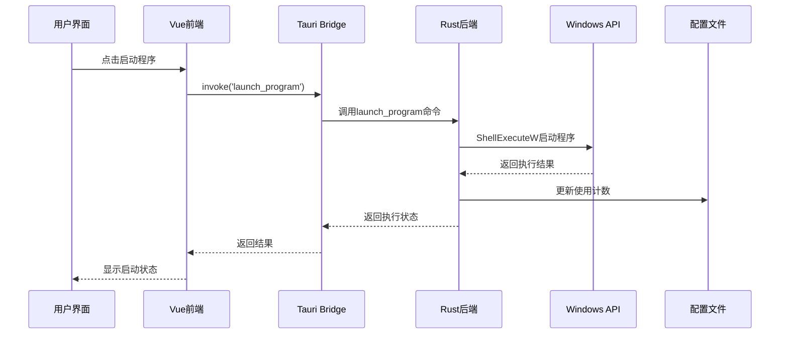

# 启动器模块实现方案

## 🎯 模块概述

**启动器模块** 是Wrapper Assistant的核心功能，实现了程序启动器的完整前后端解决方案。该模块提供程序管理、图标提取、系统集成等功能。

## 🔄 整体架构流程



## 🖥️ 前端实现详解

### 页面组件架构

```vue
<!-- src/views/launcher/index.vue -->
<template>
  <div class="launcher-container">
    <!-- 搜索栏 -->
    <div class="search-section">
      <el-input
        v-model="searchKeyword"
        placeholder="搜索程序..."
        :prefix-icon="Search"
        clearable
        @input="handleSearch"
      />
      <el-button type="primary" @click="handleScanPrograms">
        扫描系统程序
      </el-button>
      <el-button @click="handleAddProgram">
        添加程序
      </el-button>
    </div>

    <!-- 程序网格 -->
    <div class="programs-grid">
      <div
        v-for="(program, index) in filteredPrograms"
        :key="index"
        class="program-card"
        @click="handleLaunchProgram(program)"
        @contextmenu.prevent="handleRightClick(program, index, $event)"
      >
        <!-- 程序图标 -->
        <div class="program-icon">
          
          <el-icon v-else size="48">
            <Document />
          </el-icon>
        </div>

        <!-- 程序信息 -->
        <div class="program-info">
          <h3 class="program-name">{{ program.name }}</h3>
          <p class="program-path">{{ program.target_path }}</p>
          <span class="usage-count">使用次数: {{ program.count }}</span>
        </div>
      </div>
    </div>

    <!-- 右键菜单 -->
    <el-dropdown
      ref="contextMenu"
      trigger="manual"
      @command="handleMenuCommand"
    >
      <span></span>
      <template #dropdown>
        <el-dropdown-menu>
          <el-dropdown-item command="launch">启动程序</el-dropdown-item>
          <el-dropdown-item command="launch-admin">以管理员身份运行</el-dropdown-item>
          <el-dropdown-item command="edit">编辑</el-dropdown-item>
          <el-dropdown-item command="delete" class="danger">删除</el-dropdown-item>
        </el-dropdown-menu>
      </template>
    </el-dropdown>

    <!-- 添加/编辑对话框 -->
    <el-dialog
      v-model="dialogVisible"
      :title="isEditing ? '编辑程序' : '添加程序'"
      width="600px"
    >
      <el-form
        ref="formRef"
        :model="currentProgram"
        :rules="formRules"
        label-width="100px"
      >
        <el-form-item label="程序名称" prop="name">
          <el-input v-model="currentProgram.name" />
        </el-form-item>
        
        <el-form-item label="程序路径" prop="target_path">
          <el-input v-model="currentProgram.target_path">
            <template #append>
              <el-button @click="selectProgramPath">浏览</el-button>
            </template>
          </el-input>
        </el-form-item>
        
        <el-form-item label="启动参数">
          <el-input
            v-model="currentProgram.arguments"
            placeholder="可选的启动参数"
          />
        </el-form-item>
      </el-form>

      <template #footer>
        <el-button @click="dialogVisible = false">取消</el-button>
        <el-button
          type="primary"
          :loading="saving"
          @click="handleSaveProgram"
        >
          保存
        </el-button>
      </template>
    </el-dialog>
  </div>
</template>
```

### 前端逻辑实现

```typescript
// src/views/launcher/index.vue <script setup>
import { ref, computed, onMounted, nextTick } from 'vue';
import { ElMessage, ElMessageBox } from 'element-plus';
import { invoke } from '@tauri-apps/api/core';
import { open as openDialog } from '@tauri-apps/plugin-dialog';
import type { LaunchItem, LaunchConfig } from '@/types/launcher';

// 响应式状态
const programs = ref<LaunchItem[]>([]);
const searchKeyword = ref('');
const loading = ref(false);
const dialogVisible = ref(false);
const isEditing = ref(false);
const editingIndex = ref(-1);
const saving = ref(false);

// 当前编辑的程序
const currentProgram = ref<LaunchItem>({
  name: '',
  target_path: '',
  arguments: '',
  count: 0,
  icon_base64: undefined,
});

// 计算属性 - 过滤后的程序列表
const filteredPrograms = computed(() => {
  if (!searchKeyword.value) return programs.value;
  
  const keyword = searchKeyword.value.toLowerCase();
  return programs.value.filter(program =>
    program.name.toLowerCase().includes(keyword) ||
    program.target_path.toLowerCase().includes(keyword)
  );
});

// 表单验证规则
const formRules = {
  name: [
    { required: true, message: '请输入程序名称', trigger: 'blur' },
    { min: 1, max: 50, message: '名称长度应在1-50字符', trigger: 'blur' },
  ],
  target_path: [
    { required: true, message: '请选择程序路径', trigger: 'blur' },
    { validator: validateProgramPath, trigger: 'blur' },
  ],
};

// 生命周期 - 组件挂载时加载数据
onMounted(async () => {
  await loadPrograms();
});

// 数据获取
async function loadPrograms() {
  loading.value = true;
  try {
    const config: LaunchConfig = await invoke('get_all_launch_items');
    programs.value = config.items || [];
    
    ElMessage.success(`已加载 ${programs.value.length} 个程序`);
  } catch (error) {
    console.error('加载程序列表失败:', error);
    ElMessage.error('加载程序列表失败');
    
    // 开发模式下使用Mock数据
    if (import.meta.env.VITE_USE_MOCK_DATA === 'true') {
      programs.value = await import('@/mock/launcher.mock').then(m => m.mockLaunchItems);
    }
  } finally {
    loading.value = false;
  }
}

// 启动程序
async function handleLaunchProgram(program: LaunchItem, asAdmin = false) {
  try {
    const request = {
      name: program.name,
      target_path: program.target_path,
      arguments: program.arguments,
      as_admin: asAdmin,
    };

    await invoke('launch_program', { req: request });
    
    ElMessage.success(`程序 "${program.name}" 启动成功`);
    
    // 重新加载以更新使用计数
    await loadPrograms();
  } catch (error) {
    console.error('启动程序失败:', error);
    ElMessage.error(`启动程序失败: ${error}`);
  }
}

// 扫描系统程序
async function handleScanPrograms() {
  loading.value = true;
  try {
    const scannedPrograms: LaunchItem[] = await invoke('scan_system_programs');
    
    if (scannedPrograms.length === 0) {
      ElMessage.info('没有发现新的程序');
      return;
    }

    const { value } = await ElMessageBox.confirm(
      `发现 ${scannedPrograms.length} 个程序，是否添加到启动器？`,
      '扫描结果',
      {
        confirmButtonText: '添加',
        cancelButtonText: '取消',
        type: 'question',
      }
    );

    if (value === 'confirm') {
      // 合并扫描到的程序（去重）
      const existingPaths = new Set(programs.value.map(p => p.target_path));
      const newPrograms = scannedPrograms.filter(p => !existingPaths.has(p.target_path));
      
      programs.value.push(...newPrograms);
      
      // 保存配置
      await saveCurrentConfig();
      ElMessage.success(`已添加 ${newPrograms.length} 个程序`);
    }
  } catch (error) {
    console.error('扫描程序失败:', error);
    ElMessage.error('扫描程序失败');
  } finally {
    loading.value = false;
  }
}

// 保存配置到后端
async function saveCurrentConfig() {
  const config: LaunchConfig = {
    items: programs.value,
    version: '1.0.0',
    last_updated: new Date().toISOString(),
  };

  await invoke('save_launch_config', { config });
}

// 添加程序
function handleAddProgram() {
  currentProgram.value = {
    name: '',
    target_path: '',
    arguments: '',
    count: 0,
  };
  isEditing.value = false;
  dialogVisible.value = true;
}

// 编辑程序
function handleEditProgram(program: LaunchItem, index: number) {
  currentProgram.value = { ...program };
  editingIndex.value = index;
  isEditing.value = true;
  dialogVisible.value = true;
}

// 选择程序路径
async function selectProgramPath() {
  try {
    const selected = await openDialog({
      multiple: false,
      filters: [
        {
          name: '可执行文件',
          extensions: ['exe', 'msi', 'bat', 'cmd'],
        },
      ],
    });

    if (selected && typeof selected === 'string') {
      currentProgram.value.target_path = selected;
      
      // 自动提取程序名称
      if (!currentProgram.value.name) {
        const filename = selected.split('\\').pop()?.replace(/\.[^/.]+$/, '') || '';
        currentProgram.value.name = filename;
      }

      // 异步获取程序图标
      try {
        const iconBase64 = await invoke('get_icon_base64', { path: selected });
        currentProgram.value.icon_base64 = iconBase64;
      } catch (error) {
        console.warn('获取程序图标失败:', error);
      }
    }
  } catch (error) {
    console.error('选择文件失败:', error);
  }
}

// 保存程序
async function handleSaveProgram() {
  const formRef = ref();
  if (!formRef.value) return;

  try {
    await formRef.value.validate();
    saving.value = true;

    if (isEditing.value) {
      await invoke('edit_launch_item', {
        index: editingIndex.value,
        item: currentProgram.value,
      });
      programs.value[editingIndex.value] = { ...currentProgram.value };
    } else {
      await invoke('add_launch_item', { item: currentProgram.value });
      programs.value.push({ ...currentProgram.value });
    }

    ElMessage.success(isEditing.value ? '程序更新成功' : '程序添加成功');
    dialogVisible.value = false;
  } catch (error) {
    console.error('保存程序失败:', error);
    ElMessage.error('保存程序失败');
  } finally {
    saving.value = false;
  }
}

// 删除程序
async function handleDeleteProgram(index: number) {
  try {
    await ElMessageBox.confirm('确定要删除这个程序吗？', '确认删除', {
      type: 'warning',
    });

    await invoke('remove_launch_item', { index });
    programs.value.splice(index, 1);
    
    ElMessage.success('程序删除成功');
  } catch (error) {
    if (error !== 'cancel') {
      console.error('删除程序失败:', error);
      ElMessage.error('删除程序失败');
    }
  }
}

// 路径验证器
function validateProgramPath(rule: any, value: string, callback: Function) {
  if (!value) {
    callback(new Error('请选择程序路径'));
    return;
  }
  
  // 检查文件扩展名
  const validExtensions = ['.exe', '.msi', '.bat', '.cmd'];
  const hasValidExtension = validExtensions.some(ext => 
    value.toLowerCase().endsWith(ext)
  );
  
  if (!hasValidExtension) {
    callback(new Error('请选择有效的可执行文件'));
    return;
  }
  
  callback();
}
```

### 前端样式设计

```scss
// src/views/launcher/index.vue <style scoped>
.launcher-container {
  padding: 20px;
  height: 100vh;
  overflow-y: auto;

  .search-section {
    display: flex;
    gap: 16px;
    margin-bottom: 24px;
    align-items: center;

    .el-input {
      flex: 1;
      max-width: 400px;
    }
  }

  .programs-grid {
    display: grid;
    grid-template-columns: repeat(auto-fill, minmax(280px, 1fr));
    gap: 16px;

    .program-card {
      background: var(--el-bg-color);
      border: 1px solid var(--el-border-color);
      border-radius: 8px;
      padding: 16px;
      cursor: pointer;
      transition: all 0.2s ease;

      &:hover {
        transform: translateY(-2px);
        box-shadow: 0 4px 12px rgba(0, 0, 0, 0.1);
        border-color: var(--el-color-primary);
      }

      .program-icon {
        text-align: center;
        margin-bottom: 12px;

        img {
          width: 48px;
          height: 48px;
          object-fit: contain;
        }
      }

      .program-info {
        text-align: center;

        .program-name {
          font-size: 16px;
          font-weight: 600;
          margin: 0 0 8px 0;
          color: var(--el-text-color-primary);
          white-space: nowrap;
          overflow: hidden;
          text-overflow: ellipsis;
        }

        .program-path {
          font-size: 12px;
          color: var(--el-text-color-secondary);
          margin: 0 0 8px 0;
          white-space: nowrap;
          overflow: hidden;
          text-overflow: ellipsis;
        }

        .usage-count {
          font-size: 11px;
          color: var(--el-text-color-placeholder);
          background: var(--el-fill-color-light);
          padding: 2px 6px;
          border-radius: 4px;
        }
      }
    }
  }

  // 危险操作样式
  .danger {
    color: var(--el-color-danger) !important;
  }
}

// 响应式设计
@media (max-width: 768px) {
  .launcher-container {
    padding: 12px;

    .search-section {
      flex-direction: column;
      align-items: stretch;
    }

    .programs-grid {
      grid-template-columns: repeat(auto-fill, minmax(240px, 1fr));
      gap: 12px;
    }
  }
}
```

## ⚙️ 后端实现详解

### 核心数据结构

```rust
// src/launcher.rs - 数据结构定义
use serde::{Deserialize, Serialize};
use std::collections::HashMap;

/// 启动项配置
#[derive(Debug, Clone, Serialize, Deserialize)]
pub struct LaunchItem {
    /// 程序显示名称
    pub name: String,
    /// 程序可执行文件路径
    pub target_path: String,
    /// 启动参数
    pub arguments: String,
    /// 使用次数统计
    pub count: u32,
    /// Base64编码的程序图标
    pub icon_base64: Option<String>,
    /// 程序分类（可选）
    pub category: Option<String>,
    /// 创建时间
    pub created_at: Option<String>,
    /// 最后使用时间
    pub last_used: Option<String>,
}

impl Default for LaunchItem {
    fn default() -> Self {
        Self {
            name: String::new(),
            target_path: String::new(),
            arguments: String::new(),
            count: 0,
            icon_base64: None,
            category: None,
            created_at: Some(chrono::Utc::now().to_rfc3339()),
            last_used: None,
        }
    }
}

/// 启动请求参数
#[derive(Debug, Deserialize)]
pub struct LaunchRequest {
    pub name: String,
    pub target_path: String,
    pub arguments: Option<String>,
    pub as_admin: Option<bool>,
}

/// 启动配置文件
#[derive(Debug, Serialize, Deserialize)]
pub struct LaunchConfig {
    pub items: Vec<LaunchItem>,
    pub version: String,
    pub settings: LaunchSettings,
    pub last_updated: String,
}

/// 启动器设置
#[derive(Debug, Serialize, Deserialize)]
pub struct LaunchSettings {
    /// 自动扫描系统程序
    pub auto_scan: bool,
    /// 扫描路径列表
    pub scan_paths: Vec<String>,
    /// 最大使用次数记录
    pub max_usage_records: u32,
    /// 启用图标缓存
    pub enable_icon_cache: bool,
}

impl Default for LaunchConfig {
    fn default() -> Self {
        Self {
            items: Vec::new(),
            version: "1.0.0".to_string(),
            settings: LaunchSettings::default(),
            last_updated: chrono::Utc::now().to_rfc3339(),
        }
    }
}

impl Default for LaunchSettings {
    fn default() -> Self {
        Self {
            auto_scan: false,
            scan_paths: vec![
                "C:\\Program Files".to_string(),
                "C:\\Program Files (x86)".to_string(),
            ],
            max_usage_records: 1000,
            enable_icon_cache: true,
        }
    }
}
```

### 程序启动核心实现

```rust
// src/launcher.rs - 程序启动功能
use std::ffi::OsStr;
use std::os::windows::ffi::OsStrExt;
use std::ptr;
use winapi::um::shellapi::ShellExecuteW;
use winapi::um::winuser::SW_SHOWNORMAL;

/// 启动程序的主要实现函数
pub async fn launch_program_impl(req: &LaunchRequest) -> Result<String, String> {
    // 1. 路径预处理和验证
    let target_path = resolve_path_variables(&req.target_path);
    let arguments = req.arguments.as_deref().unwrap_or("");
    let as_admin = req.as_admin.unwrap_or(false);

    // 验证程序文件存在性
    if !std::path::Path::new(&target_path).exists() {
        return Err(format!("程序路径不存在: {}", target_path));
    }

    // 验证文件权限
    if !is_executable_file(&target_path) {
        return Err("指定的文件不是可执行文件".to_string());
    }

    // 2. 记录启动前状态
    let start_time = std::time::Instant::now();
    log::info!("开始启动程序: {} (路径: {})", req.name, target_path);

    // 3. 执行程序启动
    let result = unsafe {
        // 准备Windows API调用参数
        let operation = if as_admin { "runas" } else { "open" };
        let operation_wide = to_wide_string(operation);
        let target_wide = to_wide_string(&target_path);
        let args_wide = to_wide_string(arguments);
        let directory_wide = get_program_directory(&target_path);

        // 调用Windows ShellExecuteW API
        let shell_result = ShellExecuteW(
            ptr::null_mut(),                    // 父窗口句柄
            operation_wide.as_ptr(),            // 操作类型 (open/runas)
            target_wide.as_ptr(),               // 程序路径
            args_wide.as_ptr(),                 // 命令行参数
            directory_wide.as_ptr(),            // 工作目录
            SW_SHOWNORMAL,                      // 窗口显示方式
        );

        // 检查API调用结果
        if shell_result as isize <= 32 {
            return Err(format!(
                "启动程序失败，Windows错误代码: {} ({})",
                shell_result as isize,
                get_shell_error_message(shell_result as isize)
            ));
        }

        shell_result
    };

    // 4. 更新使用统计
    if let Err(e) = update_program_usage(&req.name).await {
        log::warn!("更新程序使用统计失败: {}", e);
        // 不影响主要功能，仅记录警告
    }

    // 5. 记录成功启动
    let elapsed = start_time.elapsed();
    log::info!(
        "程序启动成功: {} (耗时: {:?}ms, Shell结果: {})",
        req.name, elapsed.as_millis(), result as isize
    );

    Ok(format!(
        "程序 '{}' 启动成功 (耗时: {}ms)",
        req.name, elapsed.as_millis()
    ))
}

/// 解析路径中的变量
fn resolve_path_variables(path: &str) -> String {
    let mut resolved = path.to_string();

    // 替换自定义路径变量
    resolved = resolved.replace("%%rp%%", &get_current_exe_dir());
    resolved = resolved.replace("%%rr%%", &get_project_root_dir());
    
    // 替换系统环境变量
    if resolved.contains('%') {
        resolved = expand_environment_variables(&resolved);
    }

    resolved
}

/// 获取程序所在目录
fn get_program_directory(program_path: &str) -> Vec<u16> {
    if let Some(parent) = std::path::Path::new(program_path).parent() {
        to_wide_string(parent.to_string_lossy().as_ref())
    } else {
        to_wide_string("C:\\")
    }
}

/// 检查文件是否为可执行文件
fn is_executable_file(path: &str) -> bool {
    let path_lower = path.to_lowercase();
    let executable_extensions = [".exe", ".com", ".bat", ".cmd", ".msi", ".scr"];
    
    executable_extensions.iter().any(|ext| path_lower.ends_with(ext))
}

/// 获取Shell错误信息
fn get_shell_error_message(error_code: isize) -> &'static str {
    match error_code {
        0 => "系统内存不足",
        2 => "找不到指定的文件",
        3 => "找不到指定的路径",
        5 => "访问被拒绝",
        8 => "内存不足",
        11 => "无效的可执行文件格式",
        26 => "发生共享错误",
        27 => "文件名不完整或无效",
        28 => "操作超时",
        29 => "DDE事务失败",
        30 => "正在处理其他DDE事务而不能完成该DDE事务",
        31 => "没有应用程序与此操作相关联",
        32 => "没有应用程序与此文件相关联",
        _ => "未知错误",
    }
}

/// 更新程序使用统计
async fn update_program_usage(program_name: &str) -> Result<(), Box<dyn std::error::Error>> {
    let mut config = crate::config::load_config().await?;
    
    // 查找并更新对应程序的使用次数
    if let Some(item) = config.items.iter_mut().find(|item| item.name == program_name) {
        item.count += 1;
        item.last_used = Some(chrono::Utc::now().to_rfc3339());
        
        // 保存配置
        crate::config::save_config(&config).await?;
        
        log::debug!("已更新程序 '{}' 的使用次数为: {}", program_name, item.count);
    }
    
    Ok(())
}
```

### 图标提取系统

```rust
// src/launcher.rs - 图标提取功能
use winapi::um::shellapi::{ExtractIconW, ExtractAssociatedIconW};
use winapi::um::wingdi::{GetDIBits, BITMAPINFO, BITMAPINFOHEADER, BI_RGB};
use winapi::um::winuser::{GetDC, ReleaseDC, DestroyIcon};
use winapi::shared::windef::{HICON, HDC, HBITMAP};

/// 提取程序图标并转换为Base64编码
pub async fn extract_icon_to_base64(path: &str) -> Result<String, String> {
    let resolved_path = resolve_path_variables(path);
    
    // 验证文件存在
    if !std::path::Path::new(&resolved_path).exists() {
        return Err("程序文件不存在".to_string());
    }

    // 在新线程中执行图标提取（避免阻塞）
    let path_owned = resolved_path.clone();
    let result = tokio::task::spawn_blocking(move || {
        extract_icon_sync(&path_owned)
    }).await;

    match result {
        Ok(Ok(base64_data)) => Ok(base64_data),
        Ok(Err(e)) => Err(e),
        Err(e) => Err(format!("图标提取任务失败: {}", e)),
    }
}

/// 同步图标提取实现
fn extract_icon_sync(path: &str) -> Result<String, String> {
    unsafe {
        let path_wide = to_wide_string(path);
        
        // 尝试从可执行文件中提取图标
        let icon_handle = ExtractIconW(
            ptr::null_mut(),
            path_wide.as_ptr(),
            0,  // 提取第一个图标
        );

        // 如果直接提取失败，尝试获取关联图标
        let final_icon = if icon_handle.is_null() || icon_handle as isize <= 1 {
            let mut icon_index = 0i32;
            ExtractAssociatedIconW(
                ptr::null_mut(),
                path_wide.as_mut_ptr(),
                &mut icon_index,
            )
        } else {
            icon_handle
        };

        if final_icon.is_null() {
            return Err("无法提取程序图标".to_string());
        }

        // 将图标转换为位图数据
        let bitmap_data = match icon_to_bitmap_data(final_icon) {
            Ok(data) => data,
            Err(e) => {
                DestroyIcon(final_icon);
                return Err(e);
            }
        };

        // 清理图标句柄
        DestroyIcon(final_icon);

        // 转换为Base64
        let base64_string = base64::encode(&bitmap_data);
        Ok(format!("data:image/png;base64,{}", base64_string))
    }
}

/// 将图标转换为位图数据
unsafe fn icon_to_bitmap_data(icon: HICON) -> Result<Vec<u8>, String> {
    use winapi::um::wingdi::*;
    use winapi::um::winuser::*;

    // 获取设备上下文
    let hdc = GetDC(ptr::null_mut());
    if hdc.is_null() {
        return Err("获取设备上下文失败".to_string());
    }

    // 获取图标信息
    let mut icon_info = ICONINFO {
        fIcon: 0,
        xHotspot: 0,
        yHotspot: 0,
        hbmMask: ptr::null_mut(),
        hbmColor: ptr::null_mut(),
    };

    if GetIconInfo(icon, &mut icon_info) == 0 {
        ReleaseDC(ptr::null_mut(), hdc);
        return Err("获取图标信息失败".to_string());
    }

    // 创建兼容的设备上下文
    let mem_dc = CreateCompatibleDC(hdc);
    if mem_dc.is_null() {
        ReleaseDC(ptr::null_mut(), hdc);
        return Err("创建内存设备上下文失败".to_string());
    }

    // 获取位图尺寸
    let mut bitmap = BITMAP {
        bmType: 0,
        bmWidth: 0,
        bmHeight: 0,
        bmWidthBytes: 0,
        bmPlanes: 0,
        bmBitsPixel: 0,
        bmBits: ptr::null_mut(),
    };

    if GetObjectW(
        icon_info.hbmColor as *mut _,
        std::mem::size_of::<BITMAP>() as i32,
        &mut bitmap as *mut _ as *mut _,
    ) == 0 {
        DeleteDC(mem_dc);
        ReleaseDC(ptr::null_mut(), hdc);
        return Err("获取位图信息失败".to_string());
    }

    // 准备位图信息头
    let mut bmi = BITMAPINFO {
        bmiHeader: BITMAPINFOHEADER {
            biSize: std::mem::size_of::<BITMAPINFOHEADER>() as u32,
            biWidth: bitmap.bmWidth,
            biHeight: -bitmap.bmHeight, // 负值表示自顶向下
            biPlanes: 1,
            biBitCount: 32, // 32位RGBA
            biCompression: BI_RGB,
            biSizeImage: 0,
            biXPelsPerMeter: 0,
            biYPelsPerMeter: 0,
            biClrUsed: 0,
            biClrImportant: 0,
        },
        bmiColors: [RGBQUAD { rgbBlue: 0, rgbGreen: 0, rgbRed: 0, rgbReserved: 0 }; 1],
    };

    // 计算数据大小
    let data_size = (bitmap.bmWidth * bitmap.bmHeight * 4) as usize;
    let mut bitmap_data: Vec<u8> = vec![0; data_size];

    // 获取位图数据
    let lines_copied = GetDIBits(
        mem_dc,
        icon_info.hbmColor,
        0,
        bitmap.bmHeight as u32,
        bitmap_data.as_mut_ptr() as *mut _,
        &mut bmi,
        DIB_RGB_COLORS,
    );

    // 清理资源
    DeleteDC(mem_dc);
    ReleaseDC(ptr::null_mut(), hdc);
    DeleteObject(icon_info.hbmMask as *mut _);
    DeleteObject(icon_info.hbmColor as *mut _);

    if lines_copied == 0 {
        return Err("复制位图数据失败".to_string());
    }

    // 将BGRA转换为PNG格式
    convert_bgra_to_png(bitmap_data, bitmap.bmWidth as u32, bitmap.bmHeight as u32)
}

/// 将BGRA数据转换为PNG格式
fn convert_bgra_to_png(bgra_data: Vec<u8>, width: u32, height: u32) -> Result<Vec<u8>, String> {
    use std::io::Cursor;
    
    // 转换BGRA到RGBA
    let mut rgba_data = Vec::with_capacity(bgra_data.len());
    for chunk in bgra_data.chunks(4) {
        if chunk.len() == 4 {
            // BGRA -> RGBA
            rgba_data.push(chunk[2]); // R
            rgba_data.push(chunk[1]); // G  
            rgba_data.push(chunk[0]); // B
            rgba_data.push(chunk[3]); // A
        }
    }

    // 使用image crate编码为PNG
    let mut png_data = Vec::new();
    {
        let mut cursor = Cursor::new(&mut png_data);
        let encoder = image::codecs::png::PngEncoder::new(&mut cursor);
        
        if let Err(e) = encoder.write_image(
            &rgba_data,
            width,
            height,
            image::ColorType::Rgba8,
        ) {
            return Err(format!("PNG编码失败: {}", e));
        }
    }

    Ok(png_data)
}
```

### 系统程序扫描

```rust
// src/launcher.rs - 系统程序扫描
use std::path::{Path, PathBuf};
use std::collections::HashSet;

/// 扫描系统中的程序
pub async fn scan_system_programs_impl() -> Result<Vec<LaunchItem>, String> {
    // 在后台线程执行扫描以避免阻塞
    let result = tokio::task::spawn_blocking(|| {
        scan_programs_sync()
    }).await;

    match result {
        Ok(programs) => Ok(programs),
        Err(e) => Err(format!("程序扫描任务失败: {}", e)),
    }
}

/// 同步程序扫描实现
fn scan_programs_sync() -> Vec<LaunchItem> {
    let mut programs = Vec::new();
    let mut scanned_paths = HashSet::new();

    // 定义扫描路径和优先级
    let scan_configs = vec![
        // 高优先级路径
        ScanConfig {
            path: "C:\\Program Files",
            recursive: true,
            max_depth: 2,
            priority: Priority::High,
        },
        ScanConfig {
            path: "C:\\Program Files (x86)",
            recursive: true,
            max_depth: 2,
            priority: Priority::High,
        },
        // 中优先级路径
        ScanConfig {
            path: "C:\\Windows\\System32",
            recursive: false,
            max_depth: 1,
            priority: Priority::Medium,
        },
        // 低优先级路径
        ScanConfig {
            path: &get_user_programs_path(),
            recursive: true,
            max_depth: 3,
            priority: Priority::Low,
        },
    ];

    // 按优先级扫描
    for config in scan_configs {
        let found_programs = scan_directory_with_config(&config, &mut scanned_paths);
        programs.extend(found_programs);
        
        // 限制扫描数量，避免过多程序
        if programs.len() > 200 {
            break;
        }
    }

    // 过滤和排序
    programs = filter_and_sort_programs(programs);
    
    log::info!("扫描完成，发现 {} 个程序", programs.len());
    programs
}

#[derive(Debug)]
struct ScanConfig {
    path: &'static str,
    recursive: bool,
    max_depth: usize,
    priority: Priority,
}

#[derive(Debug, PartialEq)]
enum Priority {
    High,
    Medium, 
    Low,
}

/// 根据配置扫描目录
fn scan_directory_with_config(
    config: &ScanConfig,
    scanned_paths: &mut HashSet<PathBuf>,
) -> Vec<LaunchItem> {
    let mut programs = Vec::new();
    
    if !Path::new(config.path).exists() {
        return programs;
    }

    if config.recursive {
        programs.extend(scan_directory_recursive(
            config.path,
            0,
            config.max_depth,
            scanned_paths,
        ));
    } else {
        programs.extend(scan_directory_single(config.path, scanned_paths));
    }

    programs
}

/// 递归扫描目录
fn scan_directory_recursive(
    path: &str,
    current_depth: usize,
    max_depth: usize,
    scanned_paths: &mut HashSet<PathBuf>,
) -> Vec<LaunchItem> {
    let mut programs = Vec::new();
    
    if current_depth >= max_depth {
        return programs;
    }

    let entries = match std::fs::read_dir(path) {
        Ok(entries) => entries,
        Err(_) => return programs,
    };

    for entry in entries.flatten() {
        let entry_path = entry.path();
        
        // 避免重复扫描
        if scanned_paths.contains(&entry_path) {
            continue;
        }
        scanned_paths.insert(entry_path.clone());

        if entry_path.is_dir() {
            // 跳过系统目录和隐藏目录
            if should_skip_directory(&entry_path) {
                continue;
            }
            
            // 递归扫描子目录
            if let Some(path_str) = entry_path.to_str() {
                programs.extend(scan_directory_recursive(
                    path_str,
                    current_depth + 1,
                    max_depth,
                    scanned_paths,
                ));
            }
        } else if entry_path.is_file() {
            // 检查是否为可执行文件
            if let Some(program) = try_create_launch_item_from_path(&entry_path) {
                programs.push(program);
            }
        }
    }

    programs
}

/// 扫描单个目录（非递归）
fn scan_directory_single(
    path: &str,
    scanned_paths: &mut HashSet<PathBuf>,
) -> Vec<LaunchItem> {
    let mut programs = Vec::new();
    
    let entries = match std::fs::read_dir(path) {
        Ok(entries) => entries,
        Err(_) => return programs,
    };

    for entry in entries.flatten() {
        let entry_path = entry.path();
        
        if scanned_paths.contains(&entry_path) {
            continue;
        }
        scanned_paths.insert(entry_path.clone());

        if entry_path.is_file() {
            if let Some(program) = try_create_launch_item_from_path(&entry_path) {
                programs.push(program);
            }
        }
    }

    programs
}

/// 尝试从路径创建启动项
fn try_create_launch_item_from_path(path: &Path) -> Option<LaunchItem> {
    // 检查文件扩展名
    let extension = path.extension()?.to_str()?.to_lowercase();
    if !matches!(extension.as_str(), "exe" | "msi" | "bat" | "cmd") {
        return None;
    }

    // 跳过系统文件和临时文件
    let file_name = path.file_name()?.to_str()?;
    if should_skip_executable(file_name) {
        return None;
    }

    // 获取程序名称
    let program_name = path.file_stem()?.to_str()?.to_string();
    let target_path = path.to_str()?.to_string();

    // 创建启动项
    Some(LaunchItem {
        name: format_program_name(&program_name),
        target_path,
        arguments: String::new(),
        count: 0,
        icon_base64: None, // 图标将异步加载
        category: determine_program_category(&target_path),
        created_at: Some(chrono::Utc::now().to_rfc3339()),
        last_used: None,
    })
}

/// 判断是否应跳过目录
fn should_skip_directory(path: &Path) -> bool {
    let skip_patterns = [
        "\\$", "temp", "cache", "log", "backup", "uninstall",
        "system32\\drivers", "system32\\spool", "system32\\wbem",
    ];
    
    let path_str = path.to_string_lossy().to_lowercase();
    skip_patterns.iter().any(|pattern| path_str.contains(pattern))
}

/// 判断是否应跳过可执行文件
fn should_skip_executable(filename: &str) -> bool {
    let skip_patterns = [
        "unins", "setup", "install", "update", "patch", "helper", "service",
        "svchost", "rundll32", "regsvr32", "msiexec", "dllhost",
    ];
    
    let filename_lower = filename.to_lowercase();
    skip_patterns.iter().any(|pattern| filename_lower.contains(pattern))
}

/// 格式化程序名称
fn format_program_name(name: &str) -> String {
    name.replace("_", " ")
        .replace("-", " ")
        .split_whitespace()
        .map(|word| {
            let mut chars = word.chars();
            match chars.next() {
                None => String::new(),
                Some(first) => first.to_uppercase().chain(chars).collect(),
            }
        })
        .collect::<Vec<_>>()
        .join(" ")
}

/// 确定程序分类
fn determine_program_category(path: &str) -> Option<String> {
    let path_lower = path.to_lowercase();
    
    if path_lower.contains("microsoft") || path_lower.contains("office") {
        Some("Microsoft".to_string())
    } else if path_lower.contains("adobe") {
        Some("Adobe".to_string())
    } else if path_lower.contains("google") {
        Some("Google".to_string())
    } else if path_lower.contains("games") || path_lower.contains("steam") {
        Some("Games".to_string())
    } else if path_lower.contains("development") || path_lower.contains("visual studio") {
        Some("Development".to_string())
    } else {
        Some("Applications".to_string())
    }
}

/// 过滤和排序程序列表
fn filter_and_sort_programs(mut programs: Vec<LaunchItem>) -> Vec<LaunchItem> {
    // 去重（基于程序路径）
    programs.sort_by(|a, b| a.target_path.cmp(&b.target_path));
    programs.dedup_by(|a, b| a.target_path == b.target_path);
    
    // 按名称排序
    programs.sort_by(|a, b| a.name.cmp(&b.name));
    
    // 限制数量
    programs.truncate(100);
    
    programs
}

/// 获取用户程序路径
fn get_user_programs_path() -> String {
    dirs::data_local_dir()
        .unwrap_or_else(|| PathBuf::from("C:\\Users\\Public"))
        .join("Programs")
        .to_string_lossy()
        .to_string()
}
```

## 📊 性能优化策略

### 前端优化

1. **虚拟滚动**: 大量程序时使用虚拟列表
2. **图标缓存**: 本地缓存程序图标
3. **懒加载**: 页面可见时才加载图标
4. **防抖搜索**: 搜索输入防抖处理

### 后端优化

1. **异步处理**: 使用Tokio异步运行时
2. **并发扫描**: 并发扫描多个目录
3. **内存管理**: 及时释放Windows API资源
4. **缓存机制**: 图标和程序信息缓存

## 🔒 安全措施

### 输入验证
- 路径遍历攻击防护
- 危险字符过滤
- 文件类型验证

### 权限控制
- 最小权限原则
- UAC权限集成
- 文件权限检查

### 错误处理
- 统一错误处理机制
- 详细的日志记录
- 用户友好的错误信息

## 🧪 测试策略

### 前端测试
- 组件单元测试
- 用户交互测试
- API调用模拟测试

### 后端测试
- 功能单元测试
- Windows API集成测试
- 配置文件操作测试
- 错误处理测试

## 📈 监控与调试

### 日志系统
- 分级日志记录
- 性能监控
- 错误追踪

### 调试工具
- Rust调试符号
- 前端开发工具
- 性能分析工具

这个启动器模块为用户提供了 **功能完整、性能优异、安全可靠** 的程序管理和启动解决方案。
