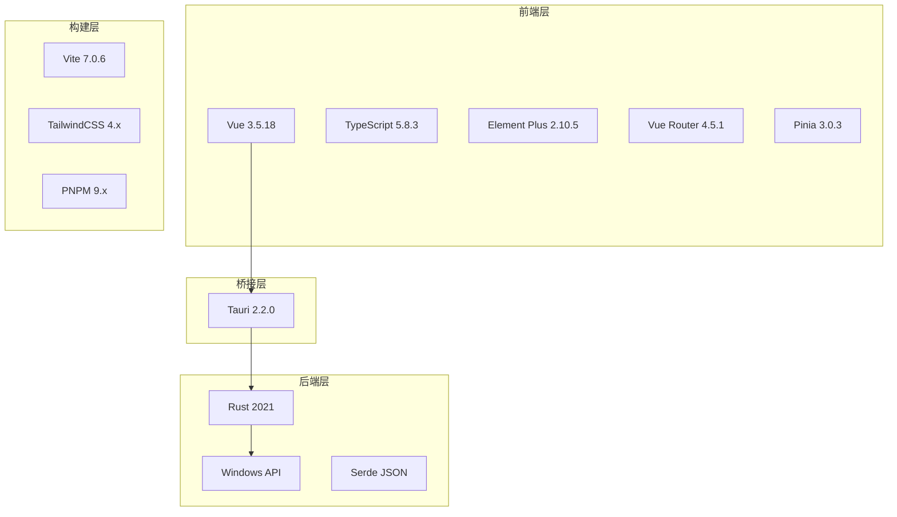

# 技术栈说明文档

## 🏗️ 整体技术架构

**Wrapper Assistant** 采用现代化的混合架构设计，结合了Web前端的灵活性和原生应用的性能优势。



## 🌐 前端技术栈

### 核心框架
| 技术 | 版本 | 作用 | 选择理由 |
|------|------|------|----------|
| **Vue 3** | 3.5.18 | 渐进式前端框架 | Composition API、响应式系统、TypeScript支持良好 |
| **TypeScript** | 5.8.3 | 类型安全的JavaScript | 提供静态类型检查，提高代码质量和开发效率 |
| **Vite** | 7.0.6 | 现代化构建工具 | 快速热更新、ES模块支持、插件生态丰富 |

### UI与样式
| 技术 | 版本 | 作用 | 特点 |
|------|------|------|------|
| **Element Plus** | 2.10.5 | Vue3组件库 | 企业级UI组件，完善的设计系统 |
| **TailwindCSS** | 4.x | 实用工具CSS框架 | 原子化CSS，快速构建自定义样式 |
| **SCSS** | - | CSS预处理器 | 支持嵌套、变量、混合器等高级特性 |

### 状态管理与路由
| 技术 | 版本 | 作用 | 优势 |
|------|------|------|------|
| **Vue Router** | 4.5.1 | 路由管理 | 支持嵌套路由、路由守卫、懒加载 |
| **Pinia** | 3.0.3 | 状态管理 | Vue3原生支持，TypeScript友好，模块化设计 |

### 开发工具链
| 技术 | 版本 | 作用 |
|------|------|------|
| **PNPM** | 9.x | 包管理器 |
| **ESLint** | - | 代码检查 |
| **Prettier** | - | 代码格式化 |
| **Vitest** | - | 单元测试 |

## ⚙️ 后端技术栈

### 核心框架
| 技术 | 版本 | 作用 | 特点 |
|------|------|------|------|
| **Tauri** | 2.2.0 | 跨平台桌面应用框架 | 轻量级、安全性高、多平台支持 |
| **Rust** | 2021 Edition | 系统级编程语言 | 内存安全、零成本抽象、高性能 |

### 系统集成
| 技术 | 作用 | 使用场景 |
|------|------|----------|
| **Windows API** | 系统底层调用 | 程序启动、图标提取、权限管理 |
| **Serde** | 序列化/反序列化 | JSON数据处理、配置文件管理 |
| **Tokio** | 异步运行时 | 异步I/O操作、并发处理 |

### 依赖库详情

#### 核心依赖
```toml
[dependencies]
tauri = { version = "2.2.0", features = ["..."] }
serde = { version = "1.0", features = ["derive"] }
serde_json = "1.0"
tokio = { version = "1.0", features = ["full"] }
```

#### 系统相关
```toml
[target.'cfg(windows)'.dependencies]
winapi = { version = "0.3", features = ["..."] }
windows = { version = "0.58", features = ["..."] }
```

## 🔗 前后端通信机制

### Tauri Bridge
**Tauri** 作为前后端的桥梁，提供类型安全的通信机制：

```typescript
// 前端调用
import { invoke } from '@tauri-apps/api/core';
const result = await invoke('backend_command', { param: value });
```

```rust
// 后端命令
#[tauri::command]
async fn backend_command(param: String) -> Result<String, String> {
    // 处理逻辑
    Ok(result)
}
```

### 数据传输格式
- **协议**: JSON格式数据交换
- **类型安全**: TypeScript接口 + Rust结构体
- **错误处理**: Result类型统一错误处理机制

## 📦 构建与部署

### 开发环境
```bash
# 前端开发服务器
pnpm dev

# Tauri开发模式（前后端联调）
pnpm tauri:dev

# 后端独立运行
cd src-tauri && cargo run
```

### 生产构建
```bash
# 前端构建
pnpm build

# 完整应用打包
pnpm tauri:build
```

### 输出产物
- **Windows**: `.exe` 安装程序 + `.msi` 安装包
- **macOS**: `.dmg` 磁盘映像 + `.app` 应用程序包
- **Linux**: `.deb` / `.rpm` 包 + AppImage

## 🎯 技术栈优势

### 性能优势
- ✅ **Rust后端**: 接近C语言的执行性能
- ✅ **Vue3**: 优化的响应式系统和虚拟DOM
- ✅ **Vite**: 快速的开发服务器和模块热替换
- ✅ **原生编译**: 无需额外运行时环境

### 开发体验
- ✅ **TypeScript**: 类型安全，IDE智能提示
- ✅ **热更新**: 前端代码修改实时预览
- ✅ **统一工具链**: PNPM统一管理前后端依赖
- ✅ **现代化语法**: async/await、ES modules等

### 维护性
- ✅ **模块化**: 清晰的前后端分离架构
- ✅ **类型系统**: 编译时捕获大部分错误
- ✅ **测试覆盖**: 单元测试 + 集成测试
- ✅ **文档完善**: 详细的架构文档

### 安全性
- ✅ **内存安全**: Rust语言特性防止内存泄漏
- ✅ **权限控制**: Tauri安全模型，最小权限原则
- ✅ **输入验证**: 前后端双重数据验证
- ✅ **CSP保护**: 内容安全策略防止XSS

## 🔄 技术演进路径

### 短期优化
- 性能监控集成
- 错误日志系统完善
- 自动化测试覆盖率提升

### 长期规划
- 支持更多操作系统平台
- 插件系统架构设计
- 云端数据同步功能
- AI辅助功能集成

这个技术栈组合为项目提供了 **现代化、高性能、类型安全** 的开发体验，同时保证了应用的 **跨平台兼容性** 和 **用户体验**。
