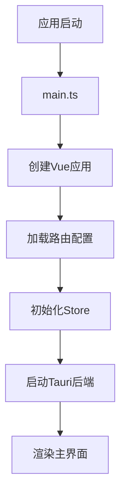
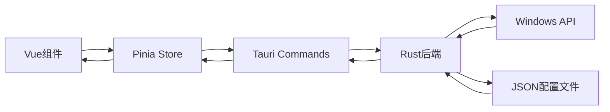

# Wrapper Assistant 项目架构说明

## � 文档导航

本项目包含以下架构文档：

- **[技术栈说明](./技术栈说明.md)** - 详细的前后端技术栈介绍
- **[前端架构](./前端架构.md)** - Vue3 + TypeScript 前端架构详解
- **[后端架构](./后端架构.md)** - Tauri + Rust 后端架构详解  
- **[启动器模块](./启动器模块说明.md)** - 程序启动器前后端实现方案

## 🎯 项目简介

**Wrapper Assistant** 是一个基于现代化技术栈的跨平台桌面应用程序，核心功能是为用户提供便捷的程序启动器管理系统。

### 核心特点
- 🚀 **高性能**: Rust后端 + Vue3前端，兼顾性能与用户体验
- 🎨 **现代化**: 基于最新的Web技术栈，UI美观易用
- 🔒 **安全性**: 权限管理系统，安全启动程序
- 🌍 **跨平台**: 基于Tauri框架，支持Windows/macOS/Linux
- 📦 **轻量级**: 原生应用体验，无需额外运行时环境

## 📁 项目结构详解

```
wrapper_assistant/
├── 📁 src/                        # 前端源码
│   ├── 📁 views/                   # 页面组件
│   │   ├── 📁 launcher/            # 🚀 程序启动器页面
│   │   ├── 📁 nested/              # 嵌套路由示例
│   │   ├── 📁 login/               # 登录页面
│   │   └── ...
│   ├── 📁 router/                  # 路由配置
│   │   ├── 📄 index.ts            # 路由主配置
│   │   ├── 📁 modules/            # 路由模块
│   │   │   ├── 📄 launcher/        # 启动器路由
│   │   │   ├── 📄 api-test.ts      # API测试路由
│   │   │   ├── 📄 nested/          # 嵌套路由
│   │   │   └── ...
│   │   └── 📄 utils.ts            # 路由工具函数
│   ├── 📁 store/                   # Pinia状态管理
│   │   ├── 📄 index.ts            # Store主配置
│   │   └── 📁 modules/            # Store模块
│   │       ├── 📄 permission.ts    # 权限管理
│   │       ├── 📄 user.ts         # 用户信息
│   │       └── 📄 app.ts          # 应用配置
│   ├── 📁 types/                   # TypeScript类型定义
│   │   ├── 📄 launcher.ts         # 启动器类型
│   │   └── ...
│   ├── 📁 mock/                    # Mock数据
│   │   └── 📄 launcher.mock.ts    # 启动器Mock API
│   ├── 📁 components/              # 公共组件
│   ├── 📁 layouts/                 # 布局组件
│   ├── 📁 hooks/                   # Vue组合式API
│   └── ...
├── 📁 src-tauri/                   # Tauri后端源码
│   ├── 📄 Cargo.toml              # Rust依赖配置
│   ├── 📄 tauri.conf.json         # Tauri配置
│   └── 📁 src/                    # Rust源码
│       ├── 📄 main.rs             # 程序入口
│       ├── 📄 lib.rs              # 库配置
│       ├── 📄 commands.rs         # Tauri命令集
│       ├── 📄 launcher.rs         # Windows启动逻辑
│       ├── 📄 config.rs           # 配置文件管理
│       └── 📄 tests.rs            # 单元测试
└── 📁 docs/                       # 文档目录
    ├── 📄 后端API测试指南.md
    ├── 📄 后端开发总结.md
    ├── 📄 程序启动器实现方案.md
    └── 📄 快速开始指南.md
```

## 🔄 系统架构流程

### 1. 应用启动流程



### 2. 路由系统架构

#### 🗂️ 路由配置机制

```typescript
// 自动扫描路由模块
const modules = import.meta.glob('./**/*.ts', { eager: true });

// 路由分类
- whiteRouteModulesList: 不需要权限的路由 (如登录页)
- routeModulesList: 需要权限验证的菜单路由
```

#### 📋 路由配置示例

```typescript
// src/router/modules/launcher/index.ts
export default {
  path: '/launcher',           // 路由路径
  name: 'RtLauncher',         // 路由名称
  component: () => import('@/views/launcher/index.vue'),
  meta: {
    title: '程序启动器',       // 菜单标题
    icon: 'iEL-management',    // 菜单图标
    showLink: true,           // 是否在菜单显示
    rank: 3,                  // 菜单排序
  },
};
```

### 3. 前后端通信架构

#### 🌉 Tauri Bridge

```typescript
// 前端调用后端
import { invoke } from '@tauri-apps/api/core';

// 获取所有程序配置
const config = await invoke('get_all_launch_items');

// 启动程序
await invoke('launch_program', { req: request });

// 扫描系统程序
const programs = await invoke('scan_system_programs');
```

#### ⚙️ 后端命令系统

```rust
// src-tauri/src/lib.rs - 命令注册
.invoke_handler(tauri::generate_handler![
    commands::get_all_launch_items,    // 获取配置
    commands::launch_program,          // 启动程序
    commands::get_icon_base64,         // 获取图标
    commands::scan_system_programs,    // 扫描程序
    // ... 更多命令
])
```

### 4. 数据流架构



## 🎯 核心功能模块

### 1. 🚀 程序启动器模块

#### 前端组件
- **位置**: `src/views/launcher/index.vue`
- **功能**: 程序展示、搜索、分类、启动

#### 后端实现
- **核心文件**: `src-tauri/src/launcher.rs`
- **Windows集成**: 
  - `ShellExecuteW`: 程序启动和管理员权限
  - `ExtractIconW`: 图标提取
  - 路径变量处理: `%%rp%%`, `%%rr%%`

#### 数据结构
```typescript
interface LaunchItem {
  name: string;           // 程序名称
  target_path: string;    // 程序路径
  arguments: string;      // 启动参数
  count: number;          // 使用统计
  icon_base64?: string;   // Base64图标
}
```

### 2. 🔐 权限管理系统

#### 权限模式
- **角色权限**: 基于用户角色的路由控制
- **后端权限**: 基于接口返回的动态路由

#### 路由守卫
- 登录状态验证
- 权限路由过滤
- 页面标题设置
- Keep-alive管理

### 3. 📊 状态管理系统

#### Store模块
- **permission**: 路由菜单、页面缓存、标签页
- **user**: 用户信息、角色管理
- **app**: 应用配置、主题设置

## 🔧 开发环境配置

### 环境变量控制

```env
# .env.local
VITE_USE_MOCK_DATA=true   # Mock模式开关
```

### 启动方式

```bash
# 前端开发
pnpm dev

# Tauri开发
pnpm tauri:dev

# 单独启动后端
cd src-tauri && cargo run
```

## 🛠️ 构建部署

### 开发构建
```bash
pnpm build              # 前端构建
pnpm tauri:build        # 完整应用构建
```

### 测试系统
- **单元测试**: 13个Rust测试用例
- **前端测试**: Vitest + Vue Test Utils

## 🎨 UI/UX系统

### 设计系统
- **组件库**: Element Plus
- **样式方案**: SCSS + TailwindCSS
- **主题系统**: 亮色/暗色主题切换
- **国际化**: Vue i18n支持

### 响应式布局
- **侧边栏**: 可折叠导航菜单
- **主内容**: 自适应内容区域
- **标签页**: 多页面标签管理

## 🔒 安全特性

### 权限安全
- 最小权限原则
- UAC权限集成
- 路径验证防护

### 数据安全
- 输入验证
- 错误信息安全
- 文件权限控制

## 📈 性能优化

### 前端优化
- 路由懒加载
- 组件按需导入
- Keep-alive缓存
- 虚拟滚动(大列表)

### 后端优化
- 异步处理
- 内存管理
- Windows API直接调用

## 🐛 调试指南

### 前端调试
- Vue DevTools
- Vite热更新
- TypeScript类型检查

### 后端调试
- Rust `println!` 输出
- Cargo测试命令
- Windows事件查看器

## 📝 总结

这是一个 **现代化的混合架构桌面应用**：

1. **前端**: 采用Vue3生态，提供现代化的Web UI体验
2. **后端**: 使用Rust/Tauri，提供高性能的系统级功能
3. **通信**: 通过Tauri Bridge实现类型安全的前后端通信
4. **部署**: 打包为原生桌面应用，无需额外运行时

### 🎯 架构优势

- ✅ **类型安全**: TypeScript + Rust 双重类型保障
- ✅ **性能优越**: Rust后端 + Vue3响应式前端
- ✅ **跨平台**: 基于Web技术的原生应用
- ✅ **可维护**: 模块化架构，清晰的职责分离
- ✅ **可扩展**: 插件化的路由和组件系统

这种架构特别适合需要 **系统级权限** 和 **现代化UI** 的桌面应用开发。
