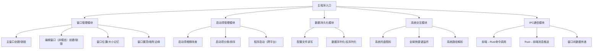

基于 **Rust + Tauri** 开发轻量启动器（带独立非模态编辑窗口）的完整架构设计、技术方案，以及所有依赖库清单。

### 一、整体架构设计
采用「前后端分离 + 分层设计」，前端负责UI交互，Rust后端负责系统级操作和数据管理，整体遵循“极简、高性能、低依赖”原则。

#### 1. 架构分层（自上而下）
| 层级         | 职责                                                                 | 技术实现                          |
|--------------|----------------------------------------------------------------------|-----------------------------------|
| UI层         | 主窗口/编辑窗口渲染、交互（表单、按钮、快捷键）、样式定制             | HTML/CSS + 原生JS（无前端框架）|
| 通信层       | 前端↔Rust后端双向通信、窗口间消息传递                                | Tauri IPC（invoke/emit/listen）|
| 核心业务层   | 启动项管理（增删改查）、窗口管理（创建/关闭/置顶）、快捷键监听         | Rust 核心逻辑 + Tauri API         |
| 数据持久层   | 启动项配置存储（本地文件）、窗口位置/大小记忆                         | Rust 轻量序列化库 + 文件IO        |
| 系统交互层   | 程序启动、托盘图标、系统快捷键、窗口吸附边缘                         | Tauri API + Rust 系统调用        |

#### 2. 核心模块划分


### 二、核心技术方案
#### 1. 核心设计原则
- **轻量优先**：前端不引入Vue/React等框架（原生JS足够），Rust依赖只选必要的轻量库；
- **性能优化**：懒加载启动项图标、单实例运行、配置文件缓存、窗口按需创建；
- **跨平台兼容**：优先适配Windows（核心场景），预留macOS/Linux适配接口；
- **用户体验**：独立非模态编辑窗口、托盘常驻、快捷键呼出/隐藏、窗口吸附边缘。

#### 2. 关键技术实现方案
| 功能点                 | 技术方案                                                                 |
|------------------------|--------------------------------------------------------------------------|
| 独立非模态编辑窗口     | Tauri WindowBuilder + modal(false) + parent(None) + 唯一窗口label        |
| 启动项配置存储         | 本地JSON文件（用户目录） + serde（序列化） + tokio（异步IO，避免阻塞）|
| 系统托盘               | Tauri tray API + 自定义托盘菜单（退出/显示主窗口）|
| 全局快捷键             | Tauri globalShortcut API + 自定义快捷键（如Alt+Space呼出主窗口）|
| 程序启动               | Tauri shell API（spawn命令） + 跨平台路径解析（path-slash库）|
| 窗口吸附边缘           | Rust监听窗口位置变化 + 系统屏幕尺寸获取（tauri-plugin-window-state）|
| 单实例运行             | Tauri single-instance 插件（避免多开进程）|
| 低内存占用             | 禁用Tauri不必要的功能（如devtools） + 前端资源内联 + Rust编译优化        |

### 三、完整依赖库清单
#### 1. Rust 后端依赖（src-tauri/Cargo.toml）
| 依赖库名称                | 版本（推荐） | 核心作用                                                                 | 是否必选 | 备注                                   |
|---------------------------|--------------|--------------------------------------------------------------------------|----------|----------------------------------------|
| tauri                     | ^1.5         | Tauri核心框架（窗口、IPC、系统交互）| 必选     | 核心依赖，仅启用必要功能               |
| serde                     | ^1.0         | 数据序列化/反序列化（配置文件JSON处理）| 必选     | 搭配serde_json使用                     |
| serde_json                | ^1.0         | JSON解析/生成                                                           | 必选     | 轻量JSON处理                           |
| serde_derive              | ^1.0         | 序列化/反序列化宏（简化结构体定义）| 必选     | 配合serde使用                           |
| tokio                     | ^1.0         | 异步运行时（异步文件IO，避免阻塞UI）| 必选     | 仅启用"full"或"rt-multi-thread"特性    |
| once_cell                 | ^1.18        | 单例管理（配置全局实例、窗口管理器）| 必选     | 轻量单例库，无运行时依赖               |
| path-slash                | ^0.2         | 跨平台路径解析（统一Windows/Linux路径分隔符）| 必选     | 解决路径兼容性问题                     |
| tauri-plugin-single-instance | ^0.1     | 单实例运行（避免多开进程）| 必选     | Tauri官方插件，防止重复启动             |
| tauri-plugin-window-state | ^0.1         | 窗口状态记忆（位置/大小）+ 屏幕信息获取                                 | 可选     | 实现窗口吸附边缘需要                   |
| tauri-plugin-global-shortcut | ^0.1     | 全局快捷键监听（替代Tauri内置的shortcut，更稳定）| 可选     | Tauri内置也可，插件版更易维护          |
| dirs                      | ^5.0         | 用户目录获取（配置文件存到用户Home/.config）| 必选     | 跨平台获取系统目录                     |
| log                       | ^0.4         | 日志输出（调试/生产环境日志）| 可选     | 开发阶段调试用，生产可禁用             |
| env_logger                | ^0.10        | 日志格式化输出                                                           | 可选     | 配合log使用                             |

#### 2. 前端依赖（无第三方库，原生实现）
| 依赖类型       | 内容                                                                 | 备注                                   |
|----------------|----------------------------------------------------------------------|----------------------------------------|
| HTML/CSS       | 原生HTML5 + CSS3（Flex/Grid布局）| 无外部样式库，手写极简样式（减少体积） |
| JavaScript     | 原生ES6+ + Tauri API（window.__TAURI__）| 无Vue/React/React，避免额外依赖         |
| 静态资源       | 可选：SVG图标（内联到HTML，避免外部文件）| 图标内联减少IO，提升启动速度           |

#### 3. Cargo.toml 完整配置示例
```toml
[package]
name = "light-launcher"
version = "0.1.0"
edition = "2021"
rust-version = "1.70"

[build-dependencies]
tauri-build = { version = "^1.5", features = [] }

[dependencies]
# 核心框架
tauri = { version = "^1.5", features = [
  "api-all",          # 按需启用：window/shell/tray/global-shortcut
  "shell-open",       # 程序启动
  "tray",             # 系统托盘
  "window-create",    # 创建编辑窗口
  "window-close",     # 关闭窗口
  "window-set-focus", # 窗口聚焦
  "macos-private-api",# macOS适配（可选）
  "windows-api"       # Windows适配（必选）
] }

# 数据序列化
serde = { version = "^1.0", features = ["derive"] }
serde_json = "^1.0"

# 异步IO
tokio = { version = "^1.0", features = ["rt-multi-thread", "fs", "io-util"] }

# 工具类
once_cell = "^1.18"
path-slash = "^0.2"
dirs = "^5.0"

# 日志（开发用）
log = { version = "^0.4", optional = true }
env_logger = { version = "^0.10", optional = true }

# Tauri插件
tauri-plugin-single-instance = { version = "^0.1" }
tauri-plugin-window-state = { version = "^0.1" }
tauri-plugin-global-shortcut = { version = "^0.1" }

[features]
default = ["log"]
dev = ["log", "env_logger"]
release = []
```

### 四、编译&打包优化配置
#### 1. Tauri 配置（src-tauri/tauri.conf.json 关键项）
```json
{
  "build": {
    "frontendDist": "../src",
    "devUrl": "http://localhost:1420",
    "beforeDevCommand": "",
    "beforeBuildCommand": ""
  },
  "bundle": {
    "active": true,
    "targets": "all",
    "identifier": "com.light.launcher",
    "icon": ["icons/icon.ico"],
    "resources": [],
    "externalBin": [],
    "copyright": "",
    "category": "Utility",
    "shortDescription": "轻量启动器",
    "longDescription": "",
    "deb": {
      "depends": []
    },
    "macOS": {
      "frameworks": [],
      "minimumSystemVersion": "",
      "exceptionDomain": "",
      "signingIdentity": null,
      "entitlements": null
    },
    "windows": {
      "certificateThumbprint": null,
      "digestAlgorithm": "sha256",
      "timestampUrl": "",
      "wix": {
        "language": "zh-CN"
      }
    }
  },
  "security": {
    "csp": "default-src 'self'; script-src 'self';"
  },
  "windows": [
    {
      "title": "轻量启动器",
      "width": 300,
      "height": 400,
      "resizable": false,
      "decorations": true,
      "fullscreen": false,
      "transparent": false,
      "titleBarStyle": "default",
      "hiddenTitle": false,
      "center": true,
      "minWidth": 300,
      "minHeight": 400,
      "maxWidth": 300,
      "maxHeight": 400
    }
  ],
  "allowlist": {
    "all": false,
    "window": {
      "all": true,
      "create": true,
      "close": true,
      "hide": true,
      "show": true,
      "setFocus": true,
      "setPosition": true,
      "setSize": true,
      "center": true
    },
    "shell": {
      "all": false,
      "open": true,
      "execute": true
    },
    "tray": {
      "all": true
    },
    "globalShortcut": {
      "all": true
    },
    "ipc": {
      "all": true
    },
    "fs": {
      "all": false,
      "readFile": true,
      "writeFile": true,
      "readDir": true,
      "createDir": true,
      "exists": true
    }
  },
  "plugins": {
    "singleInstance": {},
    "windowState": {},
    "globalShortcut": {}
  }
}
```

#### 2. Rust 编译优化（src-tauri/.cargo/config.toml）
```toml
[build]
target = "x86_64-pc-windows-msvc" # Windows平台

[profile.release]
opt-level = 3          # 最高优化级别
lto = true             # 链接时优化（减小体积、提升性能）
codegen-units = 1      # 单代码生成单元（提升优化效果）
panic = "abort"        # 禁用panic回溯（减小体积）
strip = true           # 剥离调试符号（减小体积）

[profile.dev]
opt-level = 0
debug = true
```

### 总结
1. **核心架构**：分层设计（UI/通信/业务/数据/系统），前端原生JS+HTML（无框架），Rust后端负责核心逻辑，兼顾开发效率和性能；
2. **关键依赖**：Tauri（核心）+ serde（序列化）+ tokio（异步IO）+ 轻量工具库，无冗余依赖，符合“启动快、占用低”诉求；
3. **优化重点**：编译优化（LTO/剥离符号）、前端资源内联、单实例运行、按需创建窗口，最大化降低内存占用和启动时间。

这套方案既满足“独立非模态编辑窗口”的功能需求，又能保证启动器的轻量和高性能，所有依赖均为Rust生态成熟、维护活跃的库，落地风险低。